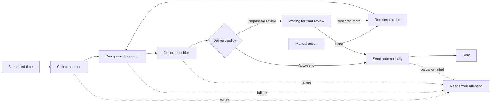
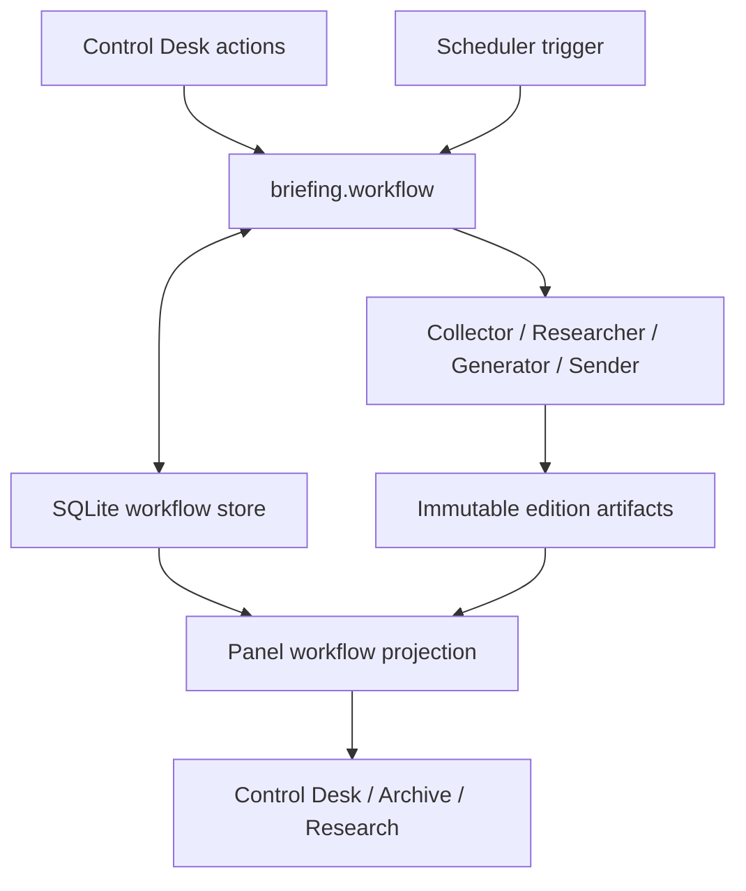

# Frontend UX/UI Redesign Plan

Date: 2026-07-31
Scope: FastAPI/Jinja/HTMX control panel in `src/panel/`
Design direction: theme-aware editorial operations console with desktop sidebar and mobile navigation drawer
Status: planning only; no application source changes included
System prerequisite: `.omx/plans/2026-07-31-workflow-system-redesign.md`

## Outcome

Preserve the distinctive editorial identity in both a dark “night desk” and a light “day desk” theme while making the control panel fast to scan, safe to operate, keyboard-accessible, and fully usable from 390px mobile through wide desktop. Move section navigation into a persistent left sidebar on desktop and an accessible temporary drawer on mobile. Keep the existing server-rendered Jinja + HTMX architecture and add no frontend dependency.

## Evidence and Current-State Audit

The audit combined source inspection with fresh Chrome renders at 1440×1000 and 390×844 for Preview, Settings, and Archive.

What already works:

- The Fraunces/IBM Plex Mono pairing, warm accent, dark surfaces, and light email preview produce a memorable and cohesive editorial identity (`src/panel/static/panel.css:1-40`, `src/panel/static/panel.css:346-356`).
- Desktop hierarchy is clear: masthead, section navigation, page title, then task content (`src/panel/templates/base.html:15-29`).
- Destructive delivery actions are visually distinguished and confirmation-protected (`src/panel/templates/preview.html:3-10`, `src/panel/templates/archive.html:44-53`).
- Reduced-motion handling exists, but is broader than necessary (`src/panel/static/panel.css:102-110`).
- Provider ordering has both drag and button paths (`src/panel/templates/settings.html:9-24`, `src/panel/templates/settings.html:47-100`).

Required review format from `emil-design-eng`:

| Before | After | Why |
| --- | --- | --- |
| Header uses one wrapping flex row for brand, eight links, and status (`base.html:15-25`; `panel.css:43-80`) | Persistent 240px left sidebar on desktop; compact top bar and temporary left drawer below 840px | Desktop gains clearer workflow grouping while mobile avoids the current 300px-tall link column |
| One dark palette is hard-coded in `:root` (`panel.css:7-21`) | Semantic theme tokens with warm light and dark palettes, System/Light/Dark control, and persisted preference | Supports daytime use without losing the editorial identity or duplicating component CSS |
| `.page-head` never wraps (`panel.css:112-113`) | Wrap at narrow widths; actions become a complete full-width row with 44px minimum targets | Preview’s Send action is clipped outside the 390px viewport |
| Archive remains `display:flex` with a fixed 240px list at every width (`panel.css:275-313`) | Stack list and reader below 720px; cap list height and show the selected edition beneath it | Current mobile reader is squeezed into a narrow off-screen column and cannot be read normally |
| Sources form remains a horizontal flex row and table has no overflow strategy (`panel.css:151-158`; `sources.html:6-23`) | Stack labeled fields on narrow screens; wrap the table in an explicit horizontal scroll region or use responsive row cards | Prevents clipped inputs and identifiers on mobile while retaining desktop density |
| Every direct child of every page runs a staggered page-load keyframe (`panel.css:102-107`) | Remove routine page-load movement; keep only purposeful state feedback and occasional enter transitions under 250ms | Frequently visited navigation should feel immediate; motion needs a task-oriented purpose |
| Button press moves down 1px and hover effects run on touch devices (`panel.css:114-133`) | `scale(0.97)` for 100–160ms press feedback; gate hover styles with `(hover: hover) and (pointer: fine)` | Produces immediate physical feedback without sticky touch-hover states |
| Transitions use built-in easing and repeated raw durations (`panel.css:77`, `125`, `171`, `255`) | Motion tokens: `--ease-out: cubic-bezier(0.23,1,0.32,1)`, 120/180/240ms; transition exact properties only | Consistent, crisp motion suited to a professional dashboard |
| Reduced motion disables all transitions, including helpful color feedback (`panel.css:108-110`) | Remove transform/movement while retaining short opacity and color state changes | Reduced motion means less spatial motion, not loss of all feedback |
| Active navigation and filters rely on classes only (`base.html:20-23`; `archive.html:4-8`) | Add `aria-current="page"` to the active section and `aria-pressed` or current-state semantics to filters | Screen-reader users need the same location/state information as sighted users |
| Inputs rely heavily on placeholder text; Sources and Research lack explicit labels (`sources.html:6-12`; `research.html:5-20`) | Add visible or visually-hidden labels, descriptions, `autocomplete` where appropriate, and field grouping | Placeholder text disappears during entry and is not a reliable accessible name |
| Focus styles are browser-default/undefined; CSS has no `:focus-visible` rule (`panel.css:1-356`) | Add a consistent high-contrast focus ring for links, buttons, fields, summaries, and draggable controls | Keyboard navigation must expose current position without relying on hover |
| HTMX actions replace a banner but expose no explicit busy state (`preview.html:3-11`; `app.py:134-175`) | Disable the initiating control during requests, expose `aria-busy`, and use an `aria-live` status region | Prevents uncertainty and repeat clicks while long-running work starts or polls |
| Iframes have no accessible title (`preview.html:33-39`; `archive.html:55-61`) | Add unique titles such as “Briefing preview, part 1: News and Learning” | Assistive technology otherwise announces anonymous frames |
| Settings exposes raw environment variable names as the primary labels (`settings.html:26-42`) | Human-readable labels and helper text, with technical keys as secondary monospace metadata | Operators should understand purpose before implementation detail |
| Provider arrow buttons are tiny and remain enabled at boundaries (`settings.html:18-21`; `panel.css:198-203`) | 44px touch targets, explicit accessible labels, and disabled first-up/last-down controls | Improves touch and keyboard safety and communicates unavailable actions |
| Status is primarily a colored dot (`app.py:745-761`) | Keep text visible, add polite live semantics, and avoid pulsing for idle; pulse only meaningful running states | State must not depend on color, and motion should communicate live work |
| Preview compresses research requests, ready findings, and every unsent archive into an “On the desk” strip (`app.py:44-60`; `preview.html:13-29`) | Replace it with a Control Desk snapshot: current stage, one prioritized attention item, queue, active edition, and next action | Counts do not explain what is blocked, what is active, or what the editor should do next |
| Every archive without a send record is called a draft (`app.py:535-562`) | Distinguish active draft awaiting review, changes requested, superseded/older draft, send failed/partial, and sent | “Unsent” is storage state, not editorial intent or required action |
| Active generation, live jobs, and ready research are process-memory-only (`state.py:1-51`; `jobs.py:1-104`) | Persist editorial workflow state and pending research handoff; reconcile it with archives, send records, and run history on startup | A server restart must not erase what needs review or falsely imply the desk is empty |

## Requirements Summary

1. Preserve the current editorial brand, type pairing, warm accent, texture, and light email-preview metaphor across both dark and light application themes.
2. Make every screen usable without horizontal page overflow at viewport widths of 390, 768, 1024, and 1440 CSS pixels.
3. Keep Jinja + HTMX and existing routes; do not introduce a SPA framework or new package.
4. Optimize the main workflow: inspect pending work → regenerate → review two parts → send; secondary configuration must remain discoverable without competing with the primary task.
5. Make navigation, forms, archive selection, provider reordering, status, and asynchronous feedback keyboard- and screen-reader-understandable.
6. Use motion only for immediate feedback, spatial continuity, or state changes; routine high-frequency navigation should be instant.
7. Preserve current backend behavior, security boundaries, and delivery confirmations.
8. Provide System, Light, and Dark appearance modes; default to the operating-system preference and persist an explicit choice locally without server storage.
9. Use a persistent left navigation sidebar on desktop and an accessible temporary left drawer on mobile/tablet.
10. Make `/preview` the Control Desk landing page (sidebar label “Control Desk”) while preserving the route and exact preview behavior.
11. Show one unambiguous editorial state for the active edition and one prioritized “Needs your attention” action.
12. Separate pending research, research in progress, research ready for generation, editions awaiting review, historical drafts, send failures, and sent editions.
13. Allow the editor to review, send, request more research, regenerate, retry a failed send, or dismiss/supersede an obsolete draft from the relevant context.
14. Preserve queue and attention state across panel restarts; never infer “running” from stale in-memory jobs.
15. Show the scheduled pipeline as a first-class workflow with next-run time, timezone, current phase, source (`Scheduled` or `Manual`), and completion/failure outcome.
16. Preserve today’s automatic scheduled delivery as the default while allowing an explicit “Prepare for review” schedule policy that stops after generation and creates a `needs_review` edition.

## Information Architecture Decision

Keep all eight routes and their names to avoid route churn, but create visual grouping:

- Primary workflow: Preview, Archive, Research
- Content inputs: Style, Sources
- Operations: Schedule, Settings, Logs

Desktop uses a persistent left sidebar with the brand at the top, grouped navigation in the middle, and status plus appearance controls near the bottom. The content column remains independently fluid and centered within its available area.

Below 840px, the sidebar becomes a temporary left drawer opened from a compact top bar. The top bar contains the menu trigger, abbreviated brand, current section, theme control, and concise status. The drawer shows all eight destinations and group labels, closes on selection, backdrop click, or Escape, restores focus to its trigger, prevents background scrolling while open, and does not trap users when JavaScript is unavailable—the navigation remains present in the document and receives a usable no-script layout.

The drawer is preferred over a horizontal rail because eight routes plus three meaningful groups exceed a small viewport and would hide destinations without clear structure. It is preferred over bottom navigation because eight equal targets cannot fit safely at 390px.

## Theme Decision

- Use semantic tokens such as `--surface-canvas`, `--surface-panel`, `--text-primary`, `--text-muted`, `--border-subtle`, `--accent`, `--success`, `--danger`, and `--focus-ring`; components must not contain theme-specific raw colors.
- Dark mode retains the current charcoal/lamplight character.
- Light mode uses warm paper/off-white surfaces, deep ink text, restrained amber accents, and subtler grain—an editorial “day desk,” not a generic white dashboard.
- Initial mode follows `prefers-color-scheme`. An explicit System/Light/Dark choice is stored in `localStorage` only.
- Apply the resolved `data-theme` before first paint to avoid a bright flash in dark mode or a dark flash in light mode.
- Declare `color-scheme` so native inputs, scrollbars, and form controls match the resolved theme.

## Control Desk Decision

Keep the existing `/preview` route for compatibility, but relabel it “Control Desk” in navigation and make the preview one part of the editorial workflow rather than the whole page.

The complete workflow has two entry paths:



The scheduled path reflects the current `run.py` behavior—Collect → Research → Generate → Send—but makes each phase and its source visible. The manual path pauses at review. The optional scheduled “Prepare for review” policy uses the same pipeline but intentionally stops after Generate.

## System Architecture Decision

The workflow must be simplified before redesigning the screens. Today, orchestration and state are fragmented:

| Current responsibility | Current location | System problem | Target owner |
| --- | --- | --- | --- |
| Scheduled orchestration | `run.py` | Separate implementation from panel actions | `briefing.workflow` |
| Manual research/generate/send orchestration | `src/panel/app.py` | Routes duplicate pipeline rules | `briefing.workflow` commands |
| Live dashboard jobs | `src/panel/jobs.py` | Process memory is treated as state | Worker/execution detail only |
| Current edition and research findings | `src/panel/state.py` | Lost on restart | Durable workflow store |
| Research queue | `research_requests.md` | File doubles as queue/database | SQLite `research_tasks` |
| Run phases | SQLite `runs` | Useful but incomplete lifecycle model | Extended durable `runs` |
| Edition contents/state | Archive Markdown + process memory | Cannot reliably review exact output after restart | SQLite edition metadata + immutable HTML artifacts |
| Send outcome | `data/send_status.json` | Separate truth from edition lifecycle | SQLite edition delivery state |

### Target Boundaries



- `src/briefing/workflow.py` is the only owner of allowed transitions and phase sequencing for both scheduled and manual actions.
- `run.py` becomes a thin scheduled trigger: load policy, call the workflow service, return an exit status.
- Panel routes validate input, submit work, and render results; they do not encode separate research/generate/send lifecycle rules.
- SQLite is the single source of truth for runs, research tasks, editions, delivery/review state, and a small append-only activity log. The activity log supports history but is not an event-sourcing framework.
- Generated HTML used for review and delivery is stored as an immutable edition artifact so restart-safe Review and Send use the same bytes. Markdown archives remain the readable/exportable archive.
- `src/panel/workflow_view.py` builds a read-only Control Desk projection from the durable store plus current worker progress; UI templates never infer state independently.
- `jobs.py` may execute background work, but “running” is valid only when paired with a durable active run. On restart, orphaned active runs become Interrupted.
- Existing Markdown research requests and JSON send records receive a one-time idempotent migration. They remain readable backups during rollout but stop being authoritative after migration.

### Minimal Durable Model

- **Run:** trigger, policy, current phase, terminal status, per-phase outcome, timestamps, warning/error summary, resulting edition.
- **Research task:** input, type, queue order, state, result, related edition/revision, timestamps.
- **Edition:** immutable revision, parent revision, source run, exact HTML artifacts, archive reference, review state, delivery state, timestamps.
- **Activity:** concise transition record for recent history and diagnostics.

This is intentionally not a general-purpose workflow platform: no broker, distributed scheduler, plugin engine, or new dependency. It is one transactional state machine around the workflow the product already has.

The desktop Control Desk uses this order; mobile keeps the same order in one column:

1. **Desk status** — one sentence such as “Researching 2 requests,” “Research ready—regenerate when ready,” “Draft ready for your review,” or “Sent at 09:22.”
2. **Needs your attention** — at most one primary card chosen by explicit priority rules, with one primary action and contextual secondary actions.
3. **Current edition** — date/source, editorial state, research included, last update, and Review/Send/Research more actions. The two email previews appear only when Review is opened, avoiding two 640px frames dominating the dashboard.
4. **Queue** — research requests and pending work in execution order, with plain-language state, age, and a permitted action.
5. **Recent activity** — the latest meaningful workflow events; Logs remains the detailed diagnostic view.

Avoid a wall of metric cards. The editor needs a next decision, not analytics.

### Editorial State Model

The Control Desk exposes these mutually exclusive states with consistent language:

| Internal state | User-facing label | Meaning | Primary action |
| --- | --- | --- | --- |
| `scheduled` | Scheduled | The next automatic run is configured but has not started | View schedule |
| `collecting` | Collecting sources | A scheduled run is updating feed data | View progress |
| `research_queued` | Research queued | One or more unchecked requests are waiting | Start research |
| `researching` | Research in progress | A live research job owns the queue | View progress |
| `research_ready` | Research ready | Findings are durable and waiting to enter an edition | Regenerate draft |
| `generating` | Generating draft | A live generation job is running | View progress |
| `needs_review` | Waiting for your review | The active generated edition has not been sent or superseded | Review draft |
| `changes_requested` | More research requested | The current draft is held while requested research is queued/running | View research |
| `sending` | Sending | A live send job is running | View progress |
| `send_failed` | Send needs attention | No part or only part of the edition was delivered | Review and retry |
| `sent` | Sent | Both parts were delivered or mailbox dedup confirmed delivery | View edition |
| `superseded` | Older draft | A newer draft replaced this unsent edition | View or dismiss |
| `dismissed` | Dismissed | Editor explicitly removed the item from attention/queue views | View in Archive |

Only one edition is active at a time. Generating a replacement marks the prior unsent active edition `superseded`; it remains available in Archive. Sending is itself the approval action, so a separate “Approved” state is unnecessary.

### Scheduled and Automatic Flow

- **Auto-send** remains the default to preserve existing behavior in `run.py:26-84`.
- **Prepare for review** is an explicit schedule policy: Collect → Research → Generate → `needs_review`; Send occurs only after editor review.
- The Control Desk always identifies the trigger as Scheduled or Manual and displays the configured delivery policy.
- Before a run, show “Next scheduled run: 05:00 Asia/Bangkok” plus the resulting local date/time—not a timezone-free clock value.
- During a scheduled run, show the active phase using the durable `runs` record and lock/progress evidence: Collecting, Researching, Generating, or Sending.
- Scheduled soft failures remain visible even when later phases continue. For example, “Sent, but 2 sources failed to collect” is a completed run with a warning, not an unqualified success.
- A partial/failed automatic send enters the same highest-priority attention path as a manual failure.
- A stale unfinished scheduled run is labeled Interrupted and offers diagnostics/retry; it is never displayed indefinitely as Running.

### Attention Priority

The Control Desk selects one attention item in this order:

1. Partial or failed send — prevent silent delivery failure.
2. Active edition waiting for review — Review, Research more, or Send.
3. Research ready — Regenerate draft.
4. Queued research that has not started — Start research.
5. Configuration preventing the next action — open the exact Settings/Sources section.

Running work is shown prominently as status but is not labeled “Needs your attention” unless it fails or becomes stale.

### “Research More” Flow

- From an active draft, **Research more** opens a compact composer tied to that edition while preserving the full Research page for history and detailed input.
- Submitting one or more topics/URLs changes the draft to `changes_requested` and adds queue items without sending or discarding the draft.
- While research runs, the current draft remains reviewable but Send is de-emphasized and explains that newer research is pending.
- When findings are ready, the primary action becomes **Regenerate with research**.
- Successful regeneration creates a new active `needs_review` edition and marks the previous draft `superseded`.

## Acceptance Criteria

### Responsive shell

- At 390px, 768px, 1024px, and 1440px, `document.documentElement.scrollWidth <= document.documentElement.clientWidth` on all eight routes.
- At widths of 840px and above, navigation is a persistent left sidebar between 224px and 256px wide; page content uses the remaining viewport without overlap.
- Below 840px, the sidebar is absent from normal layout and opens as a temporary left drawer from a top-bar button with accurate `aria-expanded` state.
- At 390px, the closed mobile top bar is no taller than 64px and no navigation item is clipped when the drawer is open.
- The mobile drawer closes on destination selection, backdrop click, and Escape; focus returns to the menu trigger and background scrolling is restored.
- Preview Regenerate and Send controls are simultaneously visible at 390px and each has a minimum 44×44px target.
- Archive stacks selector above reader below 720px; selected archive content occupies the full available width.
- Sources fields stack below 720px and the source data remains readable without causing page-level overflow.
- At 390px, Desk status, Needs your attention, Current edition, Queue, and Recent activity appear in that order with no two-column dependency.

### Control and workflow clarity

- With an active unsent generated edition, the Control Desk says “Waiting for your review” and shows Review draft, Research more, and Send actions; it never presents that edition only as an undifferentiated archive draft.
- With unchecked research requests and no running research job, the Queue reports the exact request count and the primary action is Start research.
- While research/generate/send is live, the current phase is visible after refresh and duplicate initiating controls are unavailable.
- When durable findings exist, the primary action is Regenerate with research and the UI states that findings will be consumed by regeneration.
- A partial or failed send becomes the highest-priority attention item and identifies which part failed without exposing secrets.
- A fully sent edition leaves the attention queue immediately and remains available in Current edition/Recent activity and Archive.
- Older unsent editions are labeled Older draft or Superseded; they do not inflate the active attention count.
- Research more from a draft preserves the draft, queues the new requests, and produces a replacement draft only after explicit regeneration.
- The Control Desk shows the next scheduled run and its local timezone when schedule data is available.
- After a server restart, review/queue/findings state is reconstructed from durable records; any previously running in-process job becomes Interrupted/Needs retry rather than remaining Running.
- Before a scheduled run, the Control Desk shows its next occurrence, timezone, and Auto-send or Prepare for review policy.
- During each scheduled phase, the Control Desk identifies the run as Scheduled and shows Collecting, Researching, Generating, or Sending based on durable progress evidence.
- Under Auto-send, successful generation proceeds to Send without creating a review attention item; under Prepare for review, successful generation stops at Waiting for your review.
- A scheduled run that completes with a soft Collect/Research warning and successful send reports “Sent with warnings” and links to the affected phase details.

### Interaction and feedback

- Every HTMX submit control shows an immediate pending state, cannot be unintentionally re-submitted during the initiating request, and restores on completion/error.
- Success, warning, error, and running fragments are announced through one polite live region without moving keyboard focus.
- All pointer hover-only visual changes are inside `@media (hover: hover) and (pointer: fine)`.
- Pressable controls use a 100–160ms `scale(0.97)` response; no interaction animation exceeds 300ms.
- `prefers-reduced-motion: reduce` removes transforms/position movement while retaining essential color/opacity feedback.

### Accessibility

- Every route has exactly one `h1`; heading order does not skip levels for structural sections.
- Active top-level navigation exposes `aria-current="page"`; the archive list exposes the selected entry the same way.
- All inputs/selects/textareas have programmatic labels; help text is connected with `aria-describedby` where present.
- Both preview and archive iframes have unique, meaningful `title` attributes.
- Keyboard focus is visibly discernible on every interactive control with at least a 2px outline and offset.
- Provider ordering works with keyboard buttons; unavailable direction buttons are disabled and accurately labeled.
- Status, banners, badges, and validation do not rely on color alone.

### Visual quality

- Existing Fraunces/IBM Plex Mono typography, amber accent, grain texture, and letter frames remain recognizable in both the dark “night desk” and light “day desk” themes.
- Spacing, radius, focus, duration, and easing values come from named CSS tokens rather than repeated magic values.
- Primary actions use one accent treatment; secondary actions remain quieter; dangerous or irreversible delivery actions retain confirmation.
- System, Light, and Dark modes are selectable without reloading; explicit selection survives a reload, while System tracks OS preference changes.
- No incorrect-theme flash is visible during a throttled reload in either explicit mode.
- Text, controls, status colors, and focus indicators meet WCAG 2.2 AA contrast in both themes; normal text is at least 4.5:1 and large text/control boundaries at least 3:1.

### Regression safety

- Existing panel tests pass unchanged or are updated only where markup semantics intentionally improve.
- Preview `srcdoc` byte-identity behavior remains intact (`tests/panel/test_preview.py:37-49`).
- Archive path safety, selection, send-state, and filtering behavior remains intact (`tests/panel/test_archive.py:34-68`, `85-164`).
- The server remains localhost-only and Settings continues masking secrets (`tests/panel/test_app.py`, `tests/panel/test_forms.py`).

## Implementation Plan

### 1. Lock responsive and semantic behavior with tests

Files:

- Add `tests/panel/test_ui_semantics.py`
- Extend `tests/panel/test_app.py`
- Extend `tests/panel/test_preview.py`
- Extend `tests/panel/test_archive.py`
- Extend `tests/panel/test_forms.py`

Work:

- Add response-markup tests for sidebar/navigation grouping, mobile menu semantics, theme controls, `aria-current`, labeled controls, live banner region, iframe titles, and disabled boundary reorder controls.
- Add state-machine fixtures covering queue → research → findings → generation → review → send, plus failure, restart, supersede, and dismiss paths.
- Add a lightweight browser viewport check using the already available local Chrome only if it can run without a new dependency; otherwise keep DOM assertions automated and record responsive screenshots as manual verification.
- Capture failing tests before changing templates.

Verification: run `.venv/bin/pytest tests/panel -q` and confirm new semantic assertions fail for the expected missing markup.

### 2. Unify the workflow domain, store, and orchestrator

Files:

- Add `src/briefing/workflow.py`
- Add `src/panel/workflow_view.py`
- Modify `src/briefing/db.py`
- Modify `run.py`
- Modify `src/panel/state.py`
- Modify `src/panel/jobs.py`
- Modify generation/research/send routes in `src/panel/app.py:44-180`, `202-290`, and `622-653`
- Add `tests/test_workflow.py`
- Add `tests/panel/test_workflow_view.py`

Work:

- Define one small state machine and transition API for scheduled and manual runs, research tasks, edition revisions, review state, and delivery outcome.
- Extend SQLite with transactional Run, Research task, Edition, and Activity records; do not add another JSON/Markdown source of truth.
- Persist the exact generated HTML artifacts referenced by each immutable Edition revision so review and send remain byte-consistent after restart.
- Make `run.py` a thin Scheduled trigger into `briefing.workflow`; make panel routes submit the same domain commands rather than duplicating orchestration.
- Persist research results before reporting `research_ready`; consume or attach them atomically only after a replacement Edition is successfully created.
- Add an idempotent migration that imports existing research checkbox lines, archive files, and send-status JSON. Import historical unsent archives as Older draft—not Needs review—to avoid manufacturing attention items.
- Record trigger, delivery policy, current/completed phase, per-phase warning/error, resulting edition, and terminal outcome for scheduled and manual runs.
- Keep background execution separate from truth: `jobs.py` runs commands, while durable run records determine visible state.
- Convert orphaned active runs with no live worker/lock evidence to Interrupted/Needs retry on reconciliation.
- Preserve existing collector/generator/sender module boundaries and cross-process locking; do not import `panel` from `briefing`.
- Remove or reduce `state.py`, `research_requests.md`, and `send_status.json` as authoritative runtime stores only after migration tests prove parity.

Verification: run state-transition contract tests, migration tests against representative current files, scheduled/manual parity tests, concurrency/lock tests, and restart simulations. Prove review and send use the exact persisted edition HTML and invalid transitions fail without partial writes.

### 3. Build the theme foundation

Files:

- Modify `src/panel/templates/base.html:3-12`
- Modify `src/panel/static/panel.css:7-40`
- Add `src/panel/static/panel.js`

Work:

- Replace role-specific raw colors with semantic component tokens and define warm light/dark palettes.
- Add a pre-paint theme initializer in the document head and a System/Light/Dark control in the shell.
- Persist only an explicit mode name in `localStorage`; listen for OS theme changes while System is selected.
- Set `color-scheme`, theme-aware grain opacity, form control colors, scrollbar colors, shadows, and iframe boundaries.
- Keep appearance changes limited to color/opacity; do not animate the entire page between themes.

Verification: emulate light/dark OS modes, switch all three choices, reload under network throttling, and confirm correct first paint, persistence, native-control appearance, and AA contrast.

### 4. Rebuild the responsive application shell

Files:

- Modify `src/panel/templates/base.html:15-29`
- Modify `src/panel/static/panel.css:42-110`
- Extend `src/panel/static/panel.js`

Work:

- Replace the desktop top navigation with a persistent, sticky left sidebar and fluid content region.
- Add primary/content/operations groups without changing route paths.
- Add the compact mobile top bar, menu button, backdrop, and temporary navigation drawer below 840px.
- Manage open/close state, Escape, outside click, focus restoration, background scroll lock, and `aria-expanded` in the small shared script.
- Add `aria-current="page"`, a visible status label, and a skip-to-content link.
- Introduce layout/motion tokens, breakpoint rules, safe min-width handling, and explicit drawer layering.
- Make `main` use a fluid width such as `min(100% - 2rem, 920px)` and ensure children may shrink.
- Remove global page-load rise/stagger animation from frequently visited routes.

Verification: render all routes at 390/768/1024/1440; assert no page-level horizontal overflow. At desktop, tab order begins with skip link then sidebar. At mobile, test open, complete drawer keyboard navigation, Escape close, backdrop close, destination close, focus restoration, and no background scroll.

### 5. Build the Control Desk information hierarchy

Files:

- Modify `src/panel/templates/preview.html`
- Modify `src/panel/app.py:39-61`
- Modify `src/panel/static/panel.css`
- Extend `src/panel/static/panel.js`
- Add `tests/panel/test_control_desk.py`

Work:

- Relabel the navigation destination as Control Desk while preserving `/preview` and its redirects.
- Render Desk status, one prioritized attention card, current edition summary, queue, recent activity, and next scheduled run from the workflow snapshot.
- Render Scheduled/Manual source and Auto-send/Prepare for review policy beside the active or next run.
- Use a compact horizontal stage indicator on desktop and a plain current-stage summary on mobile; completed stages support understanding but do not look clickable.
- Make Preview an explicit Review draft action/section rather than rendering two large email frames before the workflow context.
- Add contextual Review draft, Send, Research more, Regenerate with research, Retry send, View progress, and Dismiss actions only when valid for the current state.
- Show attention count beside Control Desk in the sidebar/drawer, excluding running and completed items.
- Provide precise empty states: “Nothing queued,” “No active draft,” and “Desk clear—next scheduled run …” instead of one generic empty panel.

Verification: render fixtures for every state in the table at desktop/mobile widths; assert exactly one primary attention action, accurate count, correct labels, and no invalid action for each fixture.

### 6. Establish a shared interaction and form system

Files:

- Modify `src/panel/static/panel.css:112-220`
- Modify `src/panel/templates/base.html`
- Modify banner HTML in `src/panel/app.py:134-175`, `296-298`, and `745-761`

Work:

- Standardize button, link-button, field, label, help text, disabled, focus-visible, banner, badge, and status styles.
- Gate hover styles to fine pointers.
- Use exact-property transitions and `--ease-out`; add 100–160ms press scaling.
- Add a shared `aria-live="polite"` banner target and appropriate `role="alert"` only for errors requiring immediate attention.
- Add HTMX request-state styling and disable initiating controls during request startup; keep server-side duplicate guards.
- Refine reduced-motion behavior to suppress spatial movement rather than all state transitions.

Verification: keyboard-only pass on every route; trigger one success, validation error, and long-running job; confirm immediate visual state and final live-region message.

### 7. Repair Preview and Archive task flows

Files:

- Modify `src/panel/templates/preview.html:3-52`
- Modify `src/panel/templates/archive.html:3-66`
- Modify `src/panel/static/panel.css:250-356`

Work:

- Make Preview’s title/actions wrap cleanly and retain both actions above the fold.
- Remove the old “On the desk” count strip after its information moves into the workflow snapshot.
- Add unique iframe titles and a consistent preview header for both newsletter parts.
- Give Archive filters current-state semantics.
- Stack Archive master/detail on narrow screens, cap selector height, mark the selected item semantically, and preserve the selected entry when filters change where possible.
- Keep Send/Send again prominent but visually distinguish an already-sent edition before confirmation.
- Add Archive filters for Active/Needs attention, Drafts, Sent, Failed, and All, backed by the same state labels as Control Desk.
- Surface whether an archive is Active, Superseded, Dismissed, Partial, Failed, or Sent; never infer editorial state only from absence of a send record.

Verification: run preview/archive tests; screenshot empty, generated, draft, sent, and not-found states at desktop and mobile sizes.

### 8. Make Research, Sources, Schedule, and Style legible and safe

Files:

- Modify `src/panel/templates/research.html`
- Modify `src/panel/templates/sources.html`
- Modify `src/panel/templates/schedule.html`
- Modify `run.py`
- Modify `src/panel/templates/style.html`
- Modify related sections in `src/panel/static/panel.css`

Work:

- Replace placeholder-only naming with labels and connected helper text.
- Convert Sources add controls into a responsive field grid; add table caption/header scope and a bounded overflow region or mobile row presentation.
- Use a native time input for Schedule when backend parsing compatibility is proven; otherwise retain number fields with explicit Hour/Minute labels.
- Add an explicit delivery-policy control with two choices: Auto-send (current/default) and Prepare for review; describe the exact stopping point before save.
- Show next computed occurrence with timezone and reflect the policy on both Schedule and Control Desk.
- Explain Style’s “Save + commit” side effect adjacent to its primary action and expose save result in the shared live region.
- Remove inline style attributes in favor of reusable classes.
- Make Research queue order and state match Control Desk; add a source-edition link for requests created through Research more.
- Provide queue-level Start research and item-level remove-before-start actions; do not allow removal of a running item.

Verification: run `tests/panel/test_forms.py`; complete every form at 390px using only keyboard controls and confirm validation messages identify the affected field.

### 9. Clarify Settings and provider ordering

Files:

- Modify `src/panel/templates/settings.html:3-101`
- Modify `src/panel/static/panel.css:160-204`
- Extend `tests/panel/test_forms.py`

Work:

- Group credentials/models into semantic `fieldset` sections with human-readable labels and technical key metadata.
- Keep secret values masked and preserve current autocomplete/security choices.
- Increase reorder button target size, add precise accessible names, disable invalid directions, and update disabled states after reorder.
- Keep drag as pointer enhancement, not the primary accessible interaction; gate drag hover effects to fine pointers.
- Announce the new provider position after keyboard reorder in a polite live region.
- Make Save sticky only on narrow screens if testing shows long forms hide the action; otherwise add a clear bottom action bar without obscuring fields.

Verification: reorder first/middle/last providers with keyboard and pointer; save, reload, and confirm order persistence and no secret exposure in response/log output.

### 10. Polish Logs and validate the whole system

Files:

- Modify `src/panel/templates/logs.html`
- Modify generated log fragment markup in `src/panel/app.py:712-741`
- Modify `src/panel/static/panel.css:206-220`

Work:

- Add table captions/scopes, responsive overflow, and explicit update timestamp.
- Preserve log monospace density while increasing tap/focus usability around any controls.
- Ensure polling does not repeatedly announce unchanged content; announce only meaningful status changes.
- Run a final motion pass: no animation without a purpose, no UI transition over 300ms, no touch-only sticky hover, and no layout-affecting animated properties.

Verification:

```bash
.venv/bin/pytest tests/panel -q
.venv/bin/pytest -q
```

Then launch on an alternate local port and capture desktop/mobile screenshots for all routes. Test Chrome keyboard navigation, 200% zoom at 1280px, reduced motion, and a touch-sized viewport.

## Risks and Mitigations

| Risk | Mitigation |
| --- | --- |
| Responsive fixes accidentally alter email HTML | Touch only control-panel templates/CSS; preserve preview `srcdoc` tests and generator boundaries |
| HTMX swaps remove live/busy semantics | Put stable semantics on the banner target and ensure every server fragment returns compatible roles/classes |
| Sidebar reduces content width on medium screens | Switch to the temporary drawer below 840px and keep page content fluid with explicit `min-width: 0` |
| Mobile drawer hides sections or traps keyboard users | Keep every route visible in grouped navigation; test Escape, backdrop, focus restoration, scroll lock, and no-script fallback |
| Theme initialization flashes the wrong palette | Resolve System/Light/Dark in a tiny pre-paint initializer before loading the main stylesheet |
| Light mode becomes a generic white skin or loses contrast | Use a warm editorial palette, semantic tokens, automated contrast checks, and paired visual screenshots for every route |
| Stored theme becomes stale when OS mode changes | Store only explicit mode; when mode is System, subscribe to `prefers-color-scheme` changes |
| Dashboard claims certainty from volatile process state | Reconcile through one workflow snapshot; persist review/findings state and explicitly mark orphaned jobs interrupted |
| “Draft” count continues growing and creates permanent urgency | Only the active edition can need review; replacement drafts supersede older ones and dismissed items leave attention views |
| Research more accidentally sends or destroys the reviewed draft | Hold the current draft, queue research separately, and replace it only after explicit successful regeneration |
| Multiple sources disagree about state | Define precedence in `workflow.py`: live job → durable edition/send state → durable findings/request queue → run history as diagnostic fallback |
| Adding review mode silently changes current automation | Keep Auto-send as the migration/default value; require an explicit saved policy change and show the active policy on Control Desk |
| Scheduled external process is not in the panel job registry | Use durable run phase records plus lock evidence; never depend on `jobs.JOBS` for cron progress |
| A soft early-phase error is hidden by a successful send | Preserve per-phase warnings and summarize terminal state as Sent with warnings rather than plain Sent |
| Migration incorrectly turns years of old unsent archives into urgent work | Import historical unsent archives as Older draft; create Needs review only from an explicitly active/new Edition |
| Central workflow module becomes a new monolith | Keep collector/researcher/generator/sender implementations unchanged; `briefing.workflow` owns sequencing and transitions only |
| Extra SQLite writes increase lock contention with feed collection | Use short transactions, existing retry behavior, phase-boundary writes, and cross-process concurrency tests |
| Cutover leaves two competing sources of truth | Make migration idempotent, read old files only during compatibility rollout, then remove runtime writes to legacy stores in one explicit cutover |
| CSS refactor erodes the distinctive editorial identity | Preserve palette/type/texture tokens; change layout and interaction primitives before cosmetic styling |
| Provider reorder becomes inaccessible or desynchronized | Treat buttons as canonical keyboard path; update DOM order, ranks, disabled state, and announcement from one function |
| Broad reduced-motion rule removes useful feedback | Test with emulated reduced motion and retain non-spatial color/opacity changes |
| Screenshot tests become flaky or require a dependency | Prefer semantic DOM tests; use installed Chrome for manual/bounded viewport evidence without adding a package |

## Out of Scope

- Changing newsletter content design inside the previewed email HTML.
- Replacing FastAPI, Jinja, or HTMX with a SPA framework.
- Adding authentication or exposing the localhost-only panel remotely.
- Changing collector, generator, sender, or scheduling behavior.
- Adding decorative animation, charts, dashboards, or speculative features unrelated to current workflows.

## Definition of Done

- All acceptance criteria above have fresh evidence.
- All panel and full test suites pass.
- All eight routes have desktop and 390px verification captures with no page-level clipping.
- Each route has paired light/dark desktop captures and paired 390px captures for representative workflow states.
- Sidebar/drawer behavior, System/Light/Dark persistence, keyboard, reduced-motion, contrast, and 200% zoom checks pass.
- Every editorial state has a fixture proving its label, attention priority, allowed actions, and restart behavior.
- A manual end-to-end editorial run proves: add research → start research → findings ready → regenerate → review → research more → regenerate replacement → send → sent/history, including one retryable send failure.
- A scheduled end-to-end run proves both policies: Auto-send completes Collect → Research → Generate → Send, while Prepare for review stops after Generate and creates exactly one review attention item; both surface soft warnings and hard failures correctly.
- No new dependencies are added.
- Final review confirms the UI still feels like “The Briefing,” but operates as a responsive console rather than a desktop-only page.
