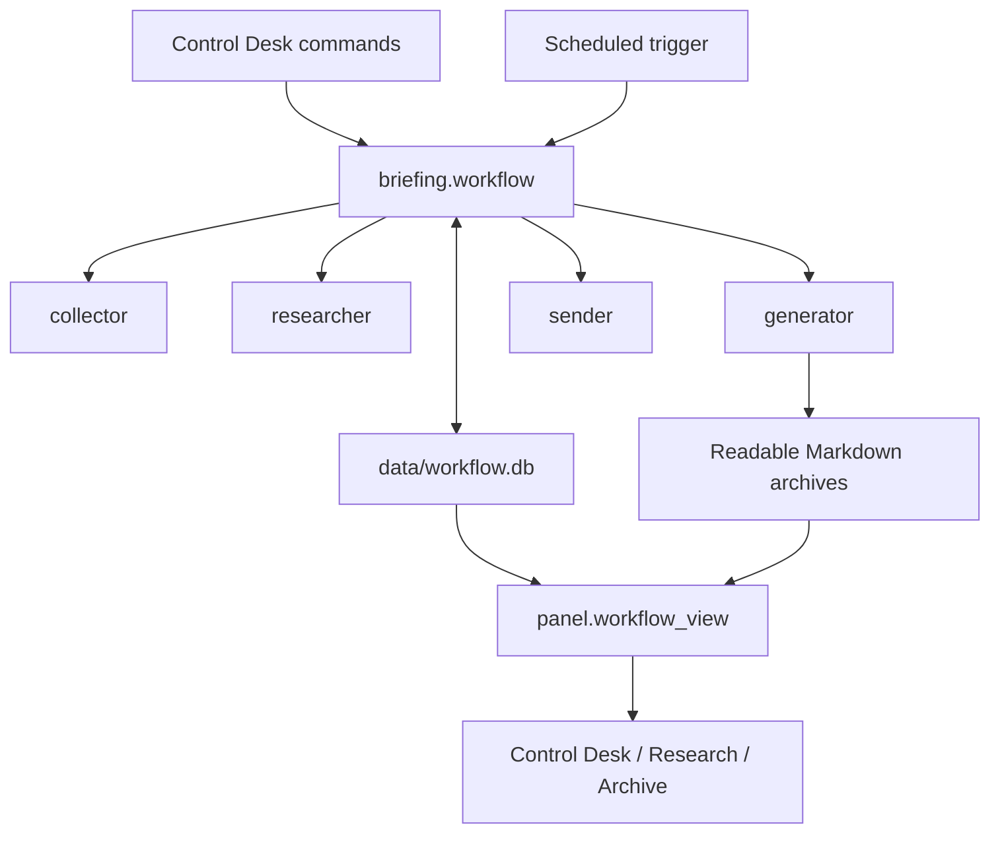
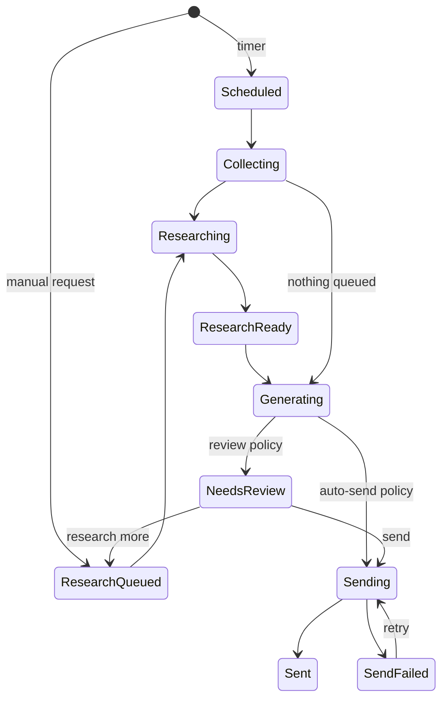

# Workflow System Redesign Plan

Date: 2026-07-31
Scope: editorial workflow orchestration, persistence, scheduling, migration, and recovery
Status: planning only
Related UX plan: `.omx/plans/2026-07-31-frontend-ux-ui-redesign.md`

## Outcome

Create one durable editorial workflow used by both scheduled and manual actions. The system must always answer:

1. What run or edition is active?
2. What phase is it in?
3. What is queued?
4. What needs editor attention?
5. What action is valid next?
6. What happened before or across a restart?

The redesign is intentionally small: one workflow service, one workflow database, existing phase implementations, and a read-only panel projection. No task broker, distributed system, SPA, or new dependency.

## Why a Separate System Plan Is Required

The current ambiguity is not primarily a template problem. State and sequencing are split across:

| Concern | Current authority | Failure mode |
| --- | --- | --- |
| Scheduled pipeline | `run.py:26-84` | Different orchestration path from manual actions |
| Manual research/generate/send | `src/panel/app.py:44-180`, `202-290`, `622-653` | Route handlers duplicate workflow decisions |
| Background execution | `src/panel/jobs.py:1-104` | Jobs and terminal history disappear on restart |
| Active preview and research handoff | `src/panel/state.py:1-51` | Current edition/findings disappear on restart |
| Research queue | `research_requests.md` parsed by `src/briefing/researcher.py:54-66` | Markdown file is acting as a queue database |
| Phase history | `runs` in `src/briefing/db.py:49-63` | Phase evidence exists but lacks active lifecycle and edition linkage |
| Edition history | `archives/` | File existence cannot distinguish active review from historical draft |
| Delivery state | `data/send_status.json` in `src/briefing/db.py:185-230` | Separate truth from edition/review lifecycle |

Adding a Control Desk directly on these sources would encode more inference and make future inconsistencies harder to repair.

## Design Principles

1. **One command path:** scheduled and manual triggers call the same workflow service.
2. **Durable truth:** process memory reports execution progress but never owns user-visible lifecycle state.
3. **Explicit transitions:** state changes occur through validated commands, not template inference.
4. **Immutable editions:** every regeneration creates a revision; old drafts remain historical and cannot silently change.
5. **Exact review/send bytes:** the reviewed HTML is the HTML sent, including after restart.
6. **Safe migration:** existing archives and records are preserved; no historical unsent file becomes urgent automatically.
7. **Small boundaries:** reuse collector, researcher, generator, sender, locks, and standard-library SQLite.

## Target Architecture

### Component Ownership

- `src/briefing/workflow.py`: command API, state transition rules, phase sequencing, delivery policy, recovery.
- `src/briefing/workflow_store.py`: workflow SQLite schema, transactions, queries, idempotent migration helpers.
- `data/workflow.db`: authoritative runs, research tasks/results, edition revisions/artifacts, delivery/review state, activity, workflow settings.
- `run.py`: thin scheduled entry point that invokes `workflow.run_scheduled()` and maps the terminal result to logs/exit status.
- `src/panel/jobs.py`: asynchronous execution adapter only; it invokes workflow commands and mirrors current phase for fast polling.
- `src/panel/workflow_view.py`: read-only projection that creates Control Desk/Archive/Research view models.
- `src/panel/app.py`: HTTP input validation, command submission, and template responses; no lifecycle inference.
- Existing `collector.py`, `researcher.py`, `generator.py`, and `sender.py`: phase implementations, kept independent and reusable.

## Canonical Workflow

Failures in Collect or Research may be soft warnings that allow later phases to proceed. Generate failure stops the run. Send partial/failure becomes editor attention. A running state without a live owner after recovery becomes `interrupted`, never permanently `running`.

## Durable Data Model

Use a separate `data/workflow.db`, not the vendor/feed SQLite database. This isolates lifecycle writes from MCP feed ingestion and reduces existing database-lock contention.

### `runs`

- `id` integer primary key
- `trigger` — `scheduled` or `manual`
- `delivery_policy` — `auto_send` or `review`
- `status` — `queued`, `running`, `completed`, `completed_with_warnings`, `failed`, `interrupted`
- `current_phase` — `collect`, `research`, `generate`, `send`, or null
- Per-phase status/detail columns
- `resulting_edition_id`
- `started_at`, `updated_at`, `finished_at`
- `warning_count`, `error_text`

### `research_tasks`

- `id` integer primary key
- `input_text`, `input_type`
- `state` — `queued`, `running`, `ready`, `consumed`, `failed`, `cancelled`
- `queue_position`
- `requested_for_edition_id` nullable
- `result_text`, `error_text`
- `created_at`, `started_at`, `finished_at`, `consumed_at`

### `editions`

- `id` integer primary key
- `parent_edition_id` nullable
- `source_run_id`
- `archive_file` unique
- `state` — `needs_review`, `changes_requested`, `sending`, `sent`, `send_failed`, `superseded`, `dismissed`
- `date_str`
- Exact `part1_html` and `part2_html` as immutable text artifacts
- Optional content hashes for verification
- `send_detail`, `sent_at`
- `created_at`, `updated_at`

### `activity`

- Entity type/id, event name, from/to state, concise detail, timestamp
- Append-only audit/history projection; not the source of current state

### `workflow_settings`

- `delivery_policy`, default `auto_send`
- Timezone identifier used for display/next-run calculation
- Do not store email credentials or API secrets

## Core Invariants

1. At most one mutating workflow run owns the workflow lock.
2. At most one edition is active in `needs_review`, `changes_requested`, `sending`, or `send_failed`.
3. An Edition’s HTML is immutable after creation.
4. Send uses the selected Edition’s persisted HTML, never a fresh re-render.
5. A replacement Edition supersedes the previous unsent active Edition transactionally.
6. Research results become `consumed` only in the transaction that records their resulting Edition.
7. `sent` requires both parts delivered or externally confirmed `already_sent`; partial delivery is `send_failed` with detail.
8. Every state transition records one Activity row in the same transaction.
9. User-visible `running` requires a durable active Run plus live lock/owner evidence.
10. Historical imports never create `needs_review` automatically.
11. Phase functions do not mutate workflow state or queue files; they accept explicit inputs and return results.
12. Archive export is derived from a committed Edition and may be retried without regenerating or changing its HTML.

## Command Interface

Keep the public API narrow:

- `queue_research(inputs, requested_for_edition=None)`
- `run_research(trigger="manual")`
- `generate_edition(trigger="manual", delivery_policy="review")`
- `request_more_research(edition_id, inputs)`
- `send_edition(edition_id)`
- `retry_send(edition_id)`
- `dismiss_edition(edition_id)`
- `run_scheduled(delivery_policy=None)`
- `recover_interrupted_runs()`

Commands validate current state and return result dictionaries suitable for both CLI logs and panel fragments. HTTP routes must not mutate tables directly.

## Concurrency and Recovery

- Add a cross-process `data/.workflow.lock` around mutating workflow commands. Reads and review rendering remain available.
- Retain the existing MCP lock inside Collect/Research and send lock around mailbox dedup/send critical sections.
- Use short SQLite transactions and `BEGIN IMMEDIATE` only around validation plus transition writes; never hold a transaction across network/model calls.
- Write “phase started,” perform external work, then transactionally write “phase completed/failed.”
- On startup or command entry, reconcile `running` runs against workflow-lock ownership/age. Stale owners become `interrupted` with a visible retry path.
- Repeated submissions are safe because transition preconditions and locks reject a second incompatible command.
- Continue mailbox deduplication as the final defense against duplicate delivery.

## Migration and Cutover

Migration must be additive, idempotent, and recoverable.

### Import rules

- Existing `runs` rows: import as historical evidence; derive Scheduled from `source=cron` and Manual from `source=dashboard`.
- `research_requests.md`: unchecked lines become queued tasks; checked lines become completed historical tasks. Preserve the original file.
- Archive Markdown: create historical Editions linked to filename/date.
- `send_status.json`: map `sent`, `partial`, and `error` to Edition delivery state/detail.
- Historical unsent archives: import as `superseded`/Older draft, never `needs_review`.
- Delivery policy: initialize to `auto_send` to preserve current scheduled behavior.
- Process-memory-only preview/findings: capture during live cutover when available; otherwise declare non-migratable and require one new action.

### Cutover stages

1. Create a timestamped backup of workflow-related legacy files and record hashes; do not remove originals.
2. Create and migrate `workflow.db` in a transaction.
3. Run migration twice in tests and prove the second run creates no duplicates or state changes.
4. Generate a shadow Control Desk projection and compare counts/statuses with legacy sources.
5. Switch scheduled and manual writes to the workflow service under one feature flag.
6. Keep legacy archives readable and optionally mirror Markdown request receipts during one compatibility window.
7. Stop runtime writes to `state.py`, research checkbox queue, and send-status JSON after parity verification.
8. Remove obsolete runtime paths only in a separate cleanup change after successful scheduled and manual runs.

Rollback before legacy-write removal: disable the feature flag and retain `workflow.db` for diagnosis. Rollback after cutover requires the documented compatibility exporter; no destructive schema downgrade.

## Implementation Plan

### 1. Specify transitions and lock existing behavior

Files:

- Add `docs/workflow-state-machine.md`
- Add `tests/test_workflow_contract.py`
- Extend existing panel, run, research, generator, and sender tests

Work:

- Encode the state/command matrix, invariants, soft versus hard failures, and scheduled/manual policy behavior as failing tests.
- Capture current auto-send, preview byte identity, research parsing, archive safety, send dedup, and localhost-only invariants.

Verification: new contract tests fail only because the new workflow API/store does not exist; all existing tests remain green.

### 2. Build the isolated workflow store

Files:

- Add `src/briefing/workflow_store.py`
- Extend `src/briefing/config.py`
- Add `tests/test_workflow_store.py`

Work:

- Create versioned SQLite schema/migrations for Runs, Research tasks, Editions, Activity, and Settings.
- Implement transactional compare-and-transition helpers and invariant checks.
- Add content hashing and immutable Edition writes.

Verification: schema upgrade, transaction rollback, invalid transition, unique active Edition, activity atomicity, and concurrent-writer tests pass.

### 3. Implement the shared workflow service

Files:

- Add `src/briefing/workflow.py`
- Adapt narrow phase entry points only where necessary
- Add `tests/test_workflow.py`

Work:

- Implement commands using existing phase modules and workflow-store transitions.
- Split `researcher` into an explicit `research_tasks(tasks, phase_cb)` operation; retain file parsing only as a migration/compatibility adapter.
- Split `generator.generate()` into content production and archive export. Content production returns Markdown/HTML without creating workflow state; archive export accepts an immutable committed Edition.
- Persist phase boundaries, warnings/errors, exact Edition HTML, research consumption, revision/supersede, and delivery outcomes.
- Introduce workflow locking and interrupted-run recovery.
- Commit the Edition and research consumption first, then perform retryable Markdown export. An export failure becomes a warning and cannot invalidate or mutate the review/send artifact.

Verification: table-driven tests cover every valid/invalid command and failure injection at each external-work boundary, including DB commit success plus archive-export failure/retry and research completion without legacy-file writes.

### 4. Unify the scheduled path

Files:

- Simplify `run.py`
- Extend schedule/config handling
- Extend run integration tests

Work:

- Replace direct phase sequencing with `workflow.run_scheduled()`.
- Preserve Auto-send as default; support Prepare for review.
- Map terminal status to logs and meaningful process exit status while preserving soft-warning continuation.

Verification: both scheduled policies use the same workflow service and produce correct durable phase/outcome records.

### 5. Unify panel commands and execution

Files:

- Modify `src/panel/app.py`
- Reduce `src/panel/state.py`
- Modify `src/panel/jobs.py`
- Extend panel command tests

Work:

- Route Research, Generate, Send, Retry, Research more, and Dismiss through workflow commands.
- Keep jobs as an execution/polling adapter; render durable command results.
- Reattach/recover through durable Run IDs rather than in-memory job IDs alone.

Verification: double-submit, restart, interrupted job, invalid action, and scheduled/manual conflict tests pass.

### 6. Build the read projection

Files:

- Add `src/panel/workflow_view.py`
- Add `tests/panel/test_workflow_view.py`

Work:

- Produce one snapshot containing active run/phase, attention item, active Edition, research queue, next schedule, and recent activity.
- Encode attention priority once; all screens consume the same labels/state.

Verification: every-state fixtures produce exactly one valid primary action and consistent labels across views.

### 7. Migrate legacy state safely

Files:

- Add `scripts/migrate_workflow_state.py`
- Add migration fixtures/tests
- Update setup/run documentation

Work:

- Implement dry-run report, backup, import, idempotency, parity report, and compatibility export.
- Never delete or overwrite archives, request Markdown, or send-status JSON during migration.

Verification: clean, populated, malformed, partially migrated, Windows-path, and repeated-run fixtures behave deterministically; backup hashes match originals.

### 8. Cut over, observe, and clean up

Files:

- Update operational documentation and launch scripts
- Remove obsolete writes only after acceptance evidence

Work:

- Run shadow projection, enable workflow writes, execute manual flow, execute both scheduled policies, then stop legacy writes.
- Keep cleanup separate and deletion-free until one successful observation window completes.

Verification: full tests, end-to-end flows, restart recovery, one real scheduled run, and parity report are green before obsolete code is removed.

## Acceptance Criteria

- Scheduled and manual actions invoke the same workflow service; route/CLI code contains no duplicate phase sequencing.
- Restarting preserves queued research, active Edition, review state, delivery failure, and recent activity.
- Restart during work changes the run to Interrupted unless a live cross-process owner is proven.
- Review and Send use byte-identical persisted HTML before and after restart.
- Auto-send remains the default after migration.
- Prepare for review stops scheduled execution after generation with exactly one `needs_review` Edition.
- Research more preserves the current Edition and supersedes it only after successful regeneration.
- Partial send identifies delivered/failed parts and remains highest attention until resolved/dismissed.
- Historical unsent archives import as Older draft and do not increase attention count.
- Running migration twice is a no-op on the second run.
- Scheduled and manual mutation cannot concurrently create two active Editions or duplicate-send one Edition.
- No credentials, API keys, passwords, or secret values enter workflow records/activity.
- Existing archive path safety, SSRF protection, provider fallback, send deduplication, and localhost-only behavior remain intact.
- Core phase functions can be tested with explicit inputs and do not read/write the legacy research queue or workflow tables implicitly.

## Verification Matrix

### Unit

- Transition matrix, invalid commands, attention priority, delivery policy, hashes, settings defaults.

### Integration

- Transactions, lock contention, migration idempotency, research consumption, Edition revision, send partial/retry, restart recovery.

### End-to-end

- Manual: queue research → research → generate → review → research more → regenerate → send.
- Scheduled Auto-send: collect → research → generate → send.
- Scheduled Prepare for review: collect → research → generate → wait → manual send.
- Failure injection at Collect, Research, Generate, and Send.

### Operational

- Control Desk snapshot during live scheduled execution.
- Interrupted process recovery.
- Database backup/restore drill.
- Workflow DB growth and query latency; local snapshot p95 target below 100ms with one year of synthetic daily runs.

## Risks and Mitigations

| Risk | Mitigation |
| --- | --- |
| Migration creates false urgent drafts | Historical unsent archives always import as Older draft |
| Workflow service becomes a monolith | It owns sequencing/transitions only; phase implementations remain separate |
| Two processes mutate workflow simultaneously | Cross-process workflow lock plus transactional state preconditions |
| Exact HTML storage grows workflow DB | Measure one-year synthetic size and document archive/backup policy |
| Legacy/new truth diverges during rollout | Shadow projection, feature-flagged cutover, parity report, then explicit legacy-write stop |
| Stale lock leaves system unusable | Owner metadata/age reconciliation and audited interrupted-run recovery |
| New policy changes automation unexpectedly | Migration/default stays Auto-send and Control Desk displays active policy |
| Workflow records leak secrets | Store identifiers/status summaries only; test redaction and ban config values from Activity details |

## Out of Scope

- Redis, Celery, Kafka, cloud queues, distributed workers, or multi-user collaboration.
- Authentication or remote exposure of the panel.
- Redesigning newsletter content.
- Replacing the feed/MCP database.
- Deleting archives or legacy state during initial migration.
- Generalized workflow/plugin configuration beyond the two delivery policies.

## Definition of Done

- One documented state machine and one workflow database exist.
- Scheduled/manual orchestration shares one tested implementation.
- Migration is idempotent, backed up, and parity-verified.
- All acceptance criteria have fresh evidence.
- Full test suite passes with zero known workflow-state inconsistencies.
- The Control Desk can consume one stable projection without reconstructing state from unrelated files.
